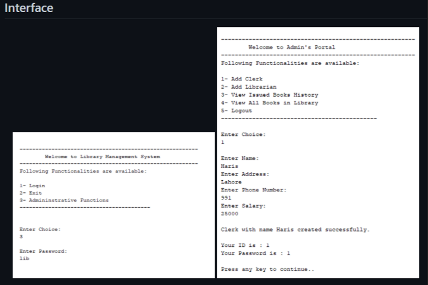

Consider the blueprint of Bank Account class

State / Attributes
accountName
accountNumber
balance

Behaviors / Methods
getAccountName()
getAccountNumber()
getBalance()
deposit(double amount)
withdraw(double amount)
***
Inquire()

Sample Interface




***


Constructor( )

```java
class Main {
  private String name;

  // constructor
  Main() {
    System.out.println("Constructor Called:");
    name = "Programiz";
  }

  public static void main(String[] args) {

    // constructor is invoked while
    // creating an object of the Main class
    Main obj = new Main();
    System.out.println("The name is " + obj.name);
  }
}


```

Need two constructors method: 

The class should contain two constructors: one should take input for account name and account number and balance. Initial balance should at least 500.00.  
```java
public BankAccount(String accountName, int accountNumber, int balance) {
        setName(accountName);
        setNumber(accountNumber);
        setBal(balance);
    }
```
The other constructor should take initial values for the three attributes as input from the program.   Objects should not be created if initial balance is less than 500.00 

```java
public BankAccount() {
        getAccountName();
        getAccountNumber();
        getBalance();
    }
```
Program

Write a program that simulates the bank transactions: deposit, withdraw and inquire. You can design your own interface.

deposit:
```java

    public void deposit(double amt) {
        this.balance += amt;
        System.out.println("Depositing " + amt + " php");
        this.printBalance();
    }
```
inquire:
```java
public void Inquire() {
        System.out.println(
                "NAME: " + this.accountName + "\nACCOUNT NUMBER: " 
                + this.accountNumber + "\nBALANCE: " + this.balance);
    }

```

withdraw:
```java
 public void withdraw(double amt) {
        this.balance -= amt;
        System.out.println("Withdrawing " + amt + " php");
        this.printBalance();
    }

```
***
constructor chaining:

```java
class Employee
{   
    public String empName;
    public int empSalary;
    public String address;

    //default constructor of the class
    public Employee()
    {
    	//this will call the constructor with String param
        this("Chaitanya");
    }

    public Employee(String name)
    {
    	//call the constructor with (String, int) param
    	this(name, 120035);
    }
    public Employee(String name, int sal)
    {
    	//call the constructor with (String, int, String) param
    	this(name, sal, "Gurgaon");
    }
    public Employee(String name, int sal, String addr)
    {
    	this.empName=name;
    	this.empSalary=sal;
    	this.address=addr;
    }

    void disp() {
    	System.out.println("Employee Name: "+empName);
    	System.out.println("Employee Salary: "+empSalary);
    	System.out.println("Employee Address: "+address);
    }
    public static void main(String[] args)
    {
        Employee obj = new Employee();
        obj.disp();
    }
}

```
Output: 

```java
Employee Name: Chaitanya
Employee Salary: 120035
Employee Address: Gurgaon
```
***
Bank account sample: 
https://github.com/rgovil17/Bank-Account-Application

```java
// The parent class for both the Savings & Checking accounts
// This class is defined as abstract as we'll not create objects of this class
// Also, it implements the interface IBaseRate to access the base rate
public abstract class Account implements IBaseRate {
	
	private static int index = 10000;

	// List common properties for both savings and checking accounts
	private String name;
	private String ssn;
	private double balance;

	protected String accNum;
	protected double rate;

	// Constructor to set base properties and initialize the account
	public Account(String name, String ssn, double initDeposit) {
		this.index++;
		this.name = name;
		this.ssn = ssn;
		this.balance = initDeposit;
		
		//Set account number
		this.accNum = this.setAccountNum();
		
		// Set the base rate
		this.setRate();
	}

	// Generating the account number
	private String setAccountNum() {
		String lastTwoSsn = ssn.substring(ssn.length() - 2);
		int uniqueFive = index;
		int randThree = (int) (Math.random() * 1000);
		return lastTwoSsn + uniqueFive + randThree;
	}

	// An abstract method to set the base rate depending upon the account type
	public abstract void setRate();

	// List common methods
	public void deposit(double amount) {
		this.balance += amount;
		System.out.println("Depositing $" + amount);
		this.printBalance();
	}

	public void withdraw(double amount) {
		this.balance -= amount;
		System.out.println("Withdrawing $" + amount);
		this.printBalance();
	}

	public void transfer(String toWhere, double amount) {
		this.balance -= amount;
		System.out.println("Transferring $" + amount + " to " + toWhere);
		this.printBalance();
	}
	
	public void compound() {
		double accruedInterest = this.balance * (this.rate / 100);
		balance += accruedInterest;
		System.out.println("Accrued Interest: $"+accruedInterest);
		this.printBalance();
	}

	public void printBalance() {
		System.out.println("Your Balance: " + this.balance);
	}
	
	public void showInfo() {
		System.out.println("NAME: " + this.name + "\nACCOUNT NUMBER: " + this.accNum + "\nBALANCE: " + this.balance
				+ "\nRATE: " + this.rate + "%");
	}
}
```
another example:

```java
class StudentData
{
   private int stuID;
   private String stuName;
   private int stuAge;
   StudentData()
   {
       //Default constructor
       stuID = 100;
       stuName = "New Student";
       stuAge = 18;
   }
   StudentData(int num1, String str, int num2)
   {
       //Parameterized constructor
       stuID = num1;
       stuName = str;
       stuAge = num2;
   }
   //Getter and setter methods
   public int getStuID() {
       return stuID;
   }
   public void setStuID(int stuID) {
       this.stuID = stuID;
   }
   public String getStuName() {
       return stuName;
   }
   public void setStuName(String stuName) {
       this.stuName = stuName;
   }
   public int getStuAge() {
       return stuAge;
   }
   public void setStuAge(int stuAge) {
       this.stuAge = stuAge;
   }

   public static void main(String args[])
   {
       //This object creation would call the default constructor
       StudentData myobj = new StudentData();
       System.out.println("Student Name is: "+myobj.getStuName());
       System.out.println("Student Age is: "+myobj.getStuAge());
       System.out.println("Student ID is: "+myobj.getStuID());

       /*This object creation would call the parameterized
        * constructor StudentData(int, String, int)*/
       StudentData myobj2 = new StudentData(555, "Chaitanya", 25);
       System.out.println("Student Name is: "+myobj2.getStuName());
       System.out.println("Student Age is: "+myobj2.getStuAge());
       System.out.println("Student ID is: "+myobj2.getStuID()); 
  }
}
```

Output:
```java
Student Name is: New Student
Student Age is: 18
Student ID is: 100
Student Name is: Chaitanya
Student Age is: 25
Student ID is: 555
```

Looping 

```java
int n;
        Scanner input = new Scanner(System.in);

        boolean loop;
        do {
            System.out.print("Enter array size from 1-100 only: ");
            n = input.nextInt();

            loop = n > 100 || n == 0;
            if (n > 100 || n == 0) {
                System.out.println("Invalid Array size. Try Again");
            }

        } while (loop);
```
If you want to invoked a function using a scanner :

```java
//from main
Scanner input = new Scanner(System.in);

        int userInput;
        userInput = extracted(input);

//the function
private static int extracted(Scanner input) {
        boolean loop;
        int userInput;
        do {

            display2();
            userInput = input.nextInt();

            loop = userInput > 3 || userInput == 0;
            if (userInput > 3 || userInput == 0) {
                System.out.println("\n[!]-Invalid funcionality. Try Again.");
                System.out.println("\n");
            }
        } while (loop);
        return userInput;
    }
	
```
Using switch in a method: 

```java
//from main
Scanner input = new Scanner(System.in);

        int userInput;
        userInput = toLoopInvalid(input);

        toValidate(userInput);

//function
private static void toValidate(int userInput) {
        switch (userInput) {
            case 1:

                break;
            case 2:
                break;
            case 3:

            default:
                break;
        }
    }

```